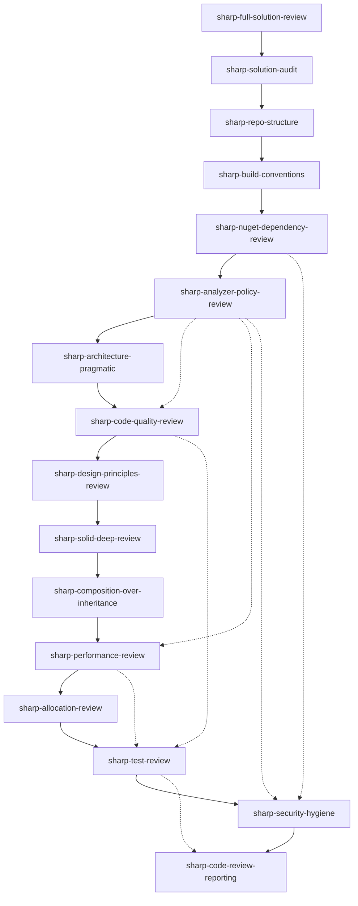

# Companion skills graph

This graph has two meanings:

1. Solid orchestration arrows show the normal directed workflow.
2. Companion references are non-recursive context or handoff relationships. They must not be used as automatic traversal instructions.

## Companion reference table

| Skill | Receives context from | Hands off to |
|---|---|---|
| `sharp-full-solution-review` | User request | All review lenses in order |
| `sharp-solution-audit` | Orchestrator | `sharp-repo-structure` |
| `sharp-repo-structure` | `sharp-solution-audit` | `sharp-build-conventions` |
| `sharp-build-conventions` | `sharp-repo-structure` | `sharp-nuget-dependency-review` |
| `sharp-nuget-dependency-review` | `sharp-build-conventions` | `sharp-analyzer-policy-review`, `sharp-security-hygiene` |
| `sharp-analyzer-policy-review` | `sharp-nuget-dependency-review`, `sharp-build-conventions` | `sharp-architecture-pragmatic`, `sharp-code-quality-review`, `sharp-performance-review`, `sharp-security-hygiene` |
| `sharp-architecture-pragmatic` | `sharp-analyzer-policy-review`, `sharp-build-conventions` | `sharp-code-quality-review` |
| `sharp-code-quality-review` | `sharp-architecture-pragmatic`, `sharp-analyzer-policy-review` | `sharp-design-principles-review`, `sharp-test-review` |
| `sharp-design-principles-review` | `sharp-code-quality-review` | `sharp-solid-deep-review` |
| `sharp-solid-deep-review` | `sharp-design-principles-review` | `sharp-composition-over-inheritance` |
| `sharp-composition-over-inheritance` | `sharp-solid-deep-review` | `sharp-performance-review` |
| `sharp-performance-review` | `sharp-composition-over-inheritance`, `sharp-analyzer-policy-review`, `sharp-nuget-dependency-review` | `sharp-allocation-review`, `sharp-test-review` |
| `sharp-allocation-review` | `sharp-performance-review`, `sharp-analyzer-policy-review` | `sharp-test-review` |
| `sharp-test-review` | `sharp-code-quality-review`, `sharp-allocation-review` | `sharp-security-hygiene`, `sharp-code-review-reporting` |
| `sharp-security-hygiene` | `sharp-nuget-dependency-review`, `sharp-analyzer-policy-review`, `sharp-test-review` | `sharp-code-review-reporting` |
| `sharp-code-review-reporting` | All prior skills | Final report |

If a SKILL.md companion section and this table disagree, this table is the package-level source of truth and the SKILL.md should be corrected.